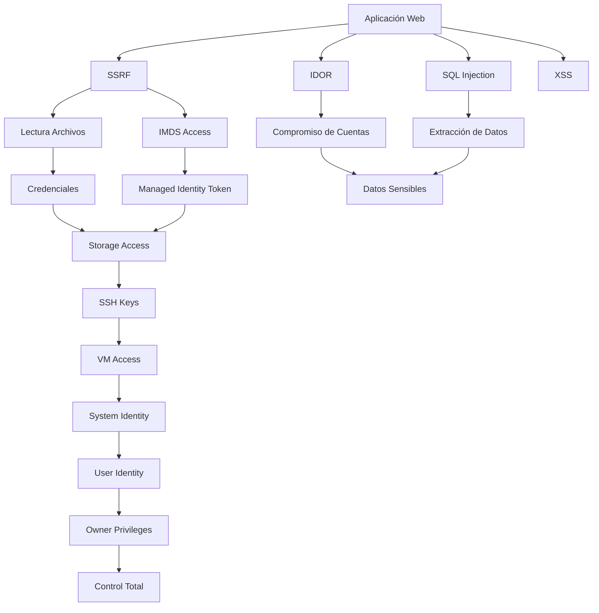

# AzureGoat - Resumen Detallado del Repositorio

## 📋 Índice
1. [¿Qué es AzureGoat?](#qué-es-azuregoat)
2. [Propósito y Objetivos](#propósito-y-objetivos)
3. [Arquitectura y Componentes](#arquitectura-y-componentes)
4. [Vulnerabilidades Implementadas](#vulnerabilidades-implementadas)
5. [Estructura del Repositorio](#estructura-del-repositorio)
6. [Guía de Instalación](#guía-de-instalación)
7. [Cómo Usar Este Repositorio](#cómo-usar-este-repositorio)
8. [Módulos de Aprendizaje](#módulos-de-aprendizaje)
9. [Recursos Adicionales](#recursos-adicionales)

---

## 🎯 ¿Qué es AzureGoat?

**AzureGoat** es una infraestructura vulnerable diseñada intencionalmente en Microsoft Azure que simula un entorno real pero con vulnerabilidades de seguridad conocidas. Es un proyecto educativo desarrollado por **INE (INE Labs)** para enseñar conceptos de seguridad en la nube.

### Características Principales:
- 🔴 **Infraestructura vulnerable por diseño** - Contiene vulnerabilidades reales para aprendizaje
- 🏗️ **Infraestructura como Código (IaC)** - Utiliza Terraform para desplegar todo el entorno
- 🎓 **Enfoque educativo** - Orientado a profesionales de seguridad y desarrolladores
- 🔐 **Múltiples vectores de ataque** - Incluye OWASP Top 10 2021 y configuraciones erróneas de Azure
- 🌐 **Aplicación web real** - Blog application con frontend React y backend Python

---

## 🎓 Propósito y Objetivos

Este repositorio está diseñado para que puedas **aprender y practicar**:

### 1. **Pentesting en la Nube (Cloud Pentesting)**
- Realizar auditorías de seguridad en infraestructuras Azure
- Identificar vulnerabilidades en servicios cloud
- Explotar configuraciones erróneas en Azure

### 2. **Red Teaming**
- Simular ataques reales en entornos cloud
- Practicar escalación de privilegios
- Explorar rutas de ataque complejas

### 3. **Auditoría de Infraestructura como Código (IaC)**
- Revisar código Terraform en busca de vulnerabilidades
- Identificar configuraciones inseguras antes del despliegue
- Aprender mejores prácticas de seguridad en IaC

### 4. **Codificación Segura (Secure Coding)**
- Entender cómo se introducen vulnerabilidades en el código
- Aprender a mitigar vulnerabilidades comunes
- Implementar controles de seguridad efectivos

### 5. **Detección y Mitigación**
- Configurar controles de seguridad en Azure
- Implementar Azure WAF (Web Application Firewall)
- Monitorear y detectar ataques

---

## 🏗️ Arquitectura y Componentes

### Servicios de Azure Utilizados:

#### 1. **Azure Functions** (Serverless)
- **Backend API** (Python 3.9) - Lógica de negocio de la aplicación
- **Frontend Hosting** (Node.js) - Sirve la aplicación React
- Ambiente de ejecución serverless con vulnerabilidades SSRF

#### 2. **Azure Cosmos DB**
- Base de datos NoSQL serverless
- Almacena datos de usuarios y publicaciones del blog
- Contiene datos vulnerables a SQL Injection

#### 3. **Azure Storage Accounts**
- **Contenedor Prod** - Almacena archivos web de producción
- **Contenedor Dev** - Almacena archivos de desarrollo (mal configurado)
- **Contenedor VM** - Almacena configuraciones de VM
- Diferentes niveles de acceso público (algunos inseguros)

#### 4. **Azure Virtual Machine (VM)**
- Ubuntu 18.04 LTS
- Identidad Managed Identity asignada
- SSH habilitado con credenciales débiles
- Usuario: `azureuser` | Password: `St0r95p@$sw0rd@1265463541` (**⚠️ Solo para demostración**)

**NOTA IMPORTANTE DE SEGURIDAD:** Todas las credenciales mostradas en este documento son únicamente para fines de demostración educativa. NUNCA uses estas credenciales en ningún entorno, ni siquiera para pruebas personales. Siempre genera credenciales únicas y seguras.

#### 5. **Azure Automation**
- Cuenta de automatización con RunBooks
- Identidad de usuario asignada con permisos elevados
- PowerShell workflows para gestión

#### 6. **Managed Identities**
- **System Assigned Identity** en VM con rol Contributor
- **User Assigned Identity** en Automation Account con rol Owner
- Configuraciones de permisos excesivos para practicar escalación

#### 7. **Networking**
- Virtual Network (VNet) con subnet
- Network Security Group con regla SSH abierta
- IP pública dinámica para la VM

### Diagrama de Arquitectura:

```
┌─────────────────────────────────────────────────────────────────┐
│                     AZUREGOAT ARCHITECTURE                       │
├─────────────────────────────────────────────────────────────────┤
│                                                                  │
│  Usuario → Azure Function (Frontend)                            │
│                    ↓                                             │
│               React Blog App                                     │
│                    ↓                                             │
│         Azure Function (Backend API)                            │
│                    ↓                                             │
│         ┌──────────┴──────────┐                                 │
│         ↓                      ↓                                 │
│    Cosmos DB           Storage Accounts                         │
│    (Datos)             (Archivos/Configs)                       │
│                                                                  │
│  Escalación de Privilegios:                                     │
│  Storage → VM → Managed Identity → Automation → Owner           │
│                                                                  │
└─────────────────────────────────────────────────────────────────┘
```

---

## 🔓 Vulnerabilidades Implementadas

### 1. **Insecure Direct Object Reference (IDOR)**
**Ubicación:** Función de cambio de contraseña en perfil de usuario

**Descripción:**
- La aplicación permite cambiar la contraseña de cualquier usuario
- El ID del usuario se envía desde el cliente sin validación
- Un atacante puede modificar el parámetro `id` para cambiar contraseñas de otros usuarios

**Explotación:**
```json
// Request vulnerable
{
  "id": "1",  // ← Se puede modificar para atacar otros usuarios
  "newPassword": "hacked123",
  "confirmNewPassword": "hacked123"
}
```

**Impacto:** 
- Compromiso total de cuentas de usuario
- Acceso no autorizado a datos sensibles

---

### 2. **SQL Injection (SQLi)**
**Ubicación:** Búsqueda de usuarios y autores en la aplicación

**Descripción:**
- Los parámetros de búsqueda no están sanitizados
- Permite inyectar código SQL malicioso
- Extrae información de todos los usuarios de la base de datos

**Explotación:**
```
Búsqueda: hello' or '1'='1
Resultado: Lista TODOS los usuarios
```

**Payload adicional:**
```json
{
  "value": "hello' or '1'='1",
  "authlevel": "' or '1'='1"
}
```

**Impacto:**
- Extracción de datos completos de usuarios
- Bypass de autenticación
- Posible lectura/escritura en base de datos

---

### 3. **Server Side Request Forgery (SSRF) - Parte 1**
**Ubicación:** Función de carga de imagen desde URL en creación de posts

**Descripción:**
- La función permite protocolos `file://` 
- El servidor lee archivos locales del sistema
- Expone archivos sensibles del ambiente de ejecución

**Explotación:**
```
URL de imagen: file:///etc/passwd
Resultado: Descarga archivo del sistema como .png
```

**Archivos críticos expuestos:**
```
file:///etc/passwd          → Usuarios del sistema
file:///proc/self/environ   → Variables de entorno (credenciales)
```

**Impacto:**
- Lectura de archivos sensibles
- Exposición de credenciales en variables de entorno
- Keys de acceso a Cosmos DB y Storage

---

### 4. **SSRF - Parte 2 (Acceso a Azure Metadata Service)**
**Ubicación:** Misma función de carga de imagen

**Descripción:**
- Acceso al Azure Instance Metadata Service (IMDS)
- Extracción de tokens de Managed Identity
- Obtención de credenciales temporales de Azure

**Explotación:**
```
URL: http://169.254.169.254/metadata/identity/oauth2/token?api-version=2018-02-01&resource=https://management.azure.com/
```

**Impacto:**
- Robo de tokens de acceso de Managed Identity
- Escalación de privilegios en Azure
- Acceso a recursos de Azure como la identidad de la VM

---

### 5. **Configuraciones Inseguras de Storage Accounts**
**Descripción:**
- Storage Account con acceso público habilitado
- Contenedores con diferentes niveles de acceso:
  - **Prod Container:** Acceso blob (archivos públicos)
  - **Dev Container:** Acceso container (lista + archivos públicos)
  - **VM Container:** Acceso container (lista + archivos públicos)

**Impacto:**
- Enumeración de archivos sensibles
- Descarga de claves SSH privadas
- Acceso a configuraciones de VM
- Descubrimiento de información sensible en contenedores dev

**Archivos expuestos:**
```
/shared/files/.ssh/config.txt    → Config SSH
/shared/files/.ssh/id_rsa        → Private SSH key
```

---

### 6. **Escalación de Privilegios a través de Identidades**
**Ruta de ataque:**

```
1. SSRF → Tokens Managed Identity VM (Contributor)
2. Storage Account → SSH Keys
3. VM Access → System Assigned Identity
4. Enumerar → User Assigned Identity (Automation)
5. User Identity → Rol Owner en Resource Group
6. Full Control → Todos los recursos
```

**Identidades configuradas:**
- **VM Identity:** Rol "Contributor" en Resource Group
- **User Assigned Identity:** Rol "Owner" en Resource Group (excesivo)

**Impacto:**
- Control completo del Resource Group
- Capacidad de crear/modificar/eliminar recursos
- Acceso a todos los secretos y credenciales

---

### 7. **Credenciales Débiles y Hard-coded**
**Ubicación:** Múltiples lugares

**Credenciales expuestas:**
```python
# En código Terraform (main.tf)
admin_password = "St0r95p@$sw0rd@1265463541"  # VM password
JWT_SECRET = "T2BYL6#]zc>Byuzu"               # JWT secret en plain text
```

**⚠️ ADVERTENCIA:** Estas son credenciales de DEMOSTRACIÓN únicamente. NUNCA uses estas credenciales en ningún entorno real, ni siquiera para pruebas. Siempre genera credenciales únicas y seguras para cada despliegue.

**Impacto:**
- Acceso directo a VM por SSH
- Posibilidad de forjar tokens JWT
- Bypass de autenticación

---

### 8. **Cross-Site Scripting (XSS)**
**Descripción:**
- Campos de entrada no sanitizados
- Posibilidad de inyectar JavaScript malicioso
- Ejecución de código en navegador de víctimas

**Impacto:**
- Robo de sesiones
- Phishing
- Ejecución de acciones en nombre de usuarios

---

## 📁 Estructura del Repositorio

```
DammVulnerableAzureInfrastructure/
│
├── 📄 main.tf                    # Archivo principal de Terraform
│   └── Define toda la infraestructura Azure
│
├── 📄 README.md                  # Documentación principal (inglés)
├── 📄 LICENSE                    # Licencia MIT
├── 📄 AzureGoat.pdf             # Presentación del proyecto
│
├── 📂 modules/
│   └── 📂 module-1/             # Módulo 1: Blog Application
│       ├── 📄 README.md         # Instrucciones de build
│       │
│       ├── 📂 src/              # Código fuente React
│       │   ├── package.json
│       │   └── src/             # Componentes React
│       │
│       └── 📂 resources/        # Recursos para despliegue
│           ├── 📂 azure_function/
│           │   ├── data/        # Backend Python API
│           │   └── react/       # Frontend Function
│           │
│           ├── 📂 cosmosdb/
│           │   ├── create-table.py
│           │   └── blog-posts.json
│           │
│           ├── 📂 storage_account/
│           │   └── webfiles/    # Build de React
│           │       └── shared/  # SSH keys, configs
│           │
│           └── 📂 vm/
│               ├── config.sh    # Script de configuración VM
│               └── listVM.ps1   # Runbook PowerShell
│
├── 📂 attack-manuals/           # Guías de explotación
│   └── 📂 module-1/
│       ├── 01-Insecure Direct Object Reference.md
│       ├── 02-Server Side Request Forgery Part 1.md
│       ├── 03-Server Side Request Forgery Part 2.md
│       ├── 04-Security Misconfiguration.md
│       └── 05-Privilege Escalation.md
│
└── 📂 defence-manuals/          # Guías de mitigación
    ├── 01-Defending Against Web Application 1.md
    ├── 02-Defending Against Web Application 2.md
    ├── 03-Defending Storage Accounts.md
    ├── 04-Defending Privilege Escalations.md
    └── 📂 images/
```

---

## ⚙️ Guía de Instalación

### Requisitos Previos:

1. **Cuenta de Microsoft Azure**
   - Suscripción activa
   - Permisos para crear recursos

2. **Herramientas Instaladas:**
   ```bash
   # Azure CLI
   curl -sL https://aka.ms/InstallAzureCLIDeb | sudo bash
   
   # Terraform >= 0.13 (recomendado: 1.5.0 o superior)
   # Instalar desde https://www.terraform.io/downloads
   wget https://releases.hashicorp.com/terraform/1.5.0/terraform_1.5.0_linux_amd64.zip
   unzip terraform_1.5.0_linux_amd64.zip
   sudo mv terraform /usr/local/bin/
   
   # Python 3
   sudo apt update
   sudo apt install python3 python3-pip python3-venv
   ```

### Pasos de Instalación:

#### **Paso 1: Clonar el Repositorio**
```bash
git clone https://github.com/ine-labs/AzureGoat
cd AzureGoat
```

#### **Paso 2: Autenticarse en Azure**
```bash
az login
```
Esto abrirá un navegador para autenticación. Sigue las instrucciones.

#### **Paso 3: Crear Resource Group**
```bash
# Crear el resource group manualmente
az group create --name azuregoat_app --location eastus
```

**⚠️ IMPORTANTE:** El resource group DEBE llamarse `azuregoat_app` (está hardcoded en el código)

#### **Paso 4: Inicializar Terraform**
```bash
terraform init
```

Esto descargará los providers necesarios:
- `hashicorp/azurerm` v3.11.0
- `hashicorp/random` v3.1.0

#### **Paso 5: Desplegar la Infraestructura**
```bash
terraform apply --auto-approve
```

**Tiempo estimado:** 10-15 minutos

**Proceso:**
1. Crea Storage Account y Containers
2. Despliega Cosmos DB
3. Configura Azure Functions (backend y frontend)
4. Crea y configura VM
5. Configura identidades y permisos
6. Sube archivos estáticos

#### **Paso 6: Obtener URL de la Aplicación**
Al finalizar, Terraform mostrará:
```
Outputs:
Target_URL = "https://appazgoat<ID>-function-app.azurewebsites.net"
```

**¡Esta es la URL de tu aplicación vulnerable!**

---

## 🎮 Cómo Usar Este Repositorio

### Para Aprendizaje Ofensivo (Red Team / Pentesting):

#### **Nivel Principiante:**
1. **Empieza con IDOR:**
   - Abre `attack-manuals/module-1/01-Insecure Direct Object Reference.md`
   - Sigue paso a paso la explotación
   - Usa Burp Suite para interceptar requests

2. **Practica SQL Injection:**
   - Busca usuarios en la aplicación
   - Prueba los payloads documentados
   - Intenta extraer todos los datos

#### **Nivel Intermedio:**
3. **Explora SSRF:**
   - Lee archivos locales del servidor
   - Extrae variables de entorno
   - Busca credenciales en `/proc/self/environ`

4. **Accede a Azure Metadata:**
   - Obtén tokens de Managed Identity
   - Usa Azure CLI con tokens robados
   - Enumera recursos accesibles

#### **Nivel Avanzado:**
5. **Escalación de Privilegios:**
   - Combina SSRF + Storage misconfig
   - Accede a la VM via SSH
   - Escala privilegios usando identidades
   - Obtén control Owner del Resource Group

### Para Aprendizaje Defensivo (Blue Team):

1. **Revisa el código:**
   - Examina `main.tf` para identificar misconfigurations
   - Revisa el código Python en `modules/module-1/resources/azure_function/data/`
   - Identifica vulnerabilidades en código React

2. **Implementa defensas:**
   - Abre `defence-manuals/01-Defending Against Web Application 1.md`
   - Configura Azure WAF
   - Implementa validación de entrada
   - Aplica principio de mínimo privilegio

3. **Configura monitoreo:**
   - Habilita Azure Security Center
   - Configura alertas para accesos anómalos
   - Implementa logging en Azure Monitor

---

## 📚 Módulos de Aprendizaje

### **Módulo 1: Blog Application Vulnerable**

#### **Aplicación:**
- Blog multi-usuario con React + Python
- Funcionalidades:
  - Registro y login de usuarios
  - Creación de posts con imágenes
  - Búsqueda de usuarios y autores
  - Perfil de usuario con cambio de contraseña
  - Dashboard personalizado

#### **Rutas de Ataque Disponibles:**

**Nota:** El siguiente diagrama usa sintaxis Mermaid. Si no se visualiza correctamente en tu visor de Markdown, consulta la versión online o usa un visor compatible con Mermaid (GitHub, GitLab, VS Code con extensión).



#### **Objetivos de Aprendizaje:**

**🎯 Objetivo 1: Explotación Web**
- Identificar y explotar IDOR
- Realizar SQL Injection
- Ejecutar XSS

**🎯 Objetivo 2: Server-Side Attacks**
- Explotar SSRF para lectura de archivos
- Acceder a Azure IMDS
- Extraer tokens de identidad

**🎯 Objetivo 3: Cloud Exploitation**
- Abusar de Storage Account misconfigurations
- Pivotar usando SSH keys
- Escalar privilegios con Managed Identities

**🎯 Objetivo 4: Post-Exploitation**
- Mantener acceso
- Enumerar recursos Azure
- Demostrar impacto completo

---

## 📖 Recursos Adicionales

### **Videos Tutoriales:**
- [Playlist Module 1 Exploitation](https://www.youtube.com/playlist?list=PLcIpBb4raSZGdYHKpqIu5Boc2ziga4oGY) - Videos oficiales del proyecto INE Labs

### **Presentaciones:**
- **BlackHat USA 2022:** Arsenal presentation
- **DEFCON 30:** Demo Labs
- **PDF incluido:** `AzureGoat.pdf` (slides completos)

### **Documentación Oficial:**
- [Azure Security Documentation](https://docs.microsoft.com/en-us/azure/security/)
- [OWASP Top 10 2021](https://owasp.org/Top10/)
- [Terraform Azure Provider](https://registry.terraform.io/providers/hashicorp/azurerm/latest/docs)

### **Proyectos Hermanos:**
- [AWSGoat](https://github.com/ine-labs/AWSGoat) - Versión para AWS
- [GCPGoat](https://github.com/ine-labs/GCPGoat) - Versión para Google Cloud

### **Herramientas Recomendadas:**

**Para Pentesting:**
```bash
# Burp Suite - Proxy HTTP
https://portswigger.net/burp

# Azure CLI - Gestión de Azure
az --version

# ScoutSuite - Auditoría Azure
pip install scoutSuite

# PowerZure - Exploitation toolkit
https://github.com/hausec/PowerZure
```

**Para Desarrollo:**
```bash
# Terraform
terraform --version

# Node.js & npm
node --version

# Python 3
python3 --version
```

---

## 🛡️ Mejores Prácticas de Seguridad (Aprendidas)

### **Desarrollo de Aplicaciones:**

1. **Validación de Entrada:**
   - ✅ Validar TODO input del usuario
   - ✅ Usar prepared statements para SQL
   - ✅ Sanitizar datos antes de mostrar (XSS)
   - ✅ Validar en servidor, no solo cliente

2. **Autenticación y Autorización:**
   - ✅ Implementar RBAC (Role-Based Access Control)
   - ✅ Validar permisos en el servidor
   - ✅ No confiar en IDs del cliente
   - ✅ Usar tokens seguros (JWT con secreto fuerte)

3. **Gestión de Secretos:**
   - ✅ NO hardcodear credenciales
   - ✅ Usar Azure Key Vault
   - ✅ Rotar secretos regularmente
   - ✅ Usar Managed Identities

### **Configuración de Azure:**

1. **Storage Accounts:**
   - ✅ Deshabilitar acceso público
   - ✅ Usar SAS tokens con expiración
   - ✅ Implementar firewall rules
   - ✅ Habilitar auditoría

2. **Identidades y Permisos:**
   - ✅ Principio de mínimo privilegio
   - ✅ Evitar rol "Owner" innecesario
   - ✅ Usar Service Principals específicos
   - ✅ Auditar asignaciones de roles

3. **Networking:**
   - ✅ Usar Network Security Groups restrictivos
   - ✅ Habilitar solo puertos necesarios
   - ✅ Implementar Private Endpoints
   - ✅ Usar Azure Firewall

4. **Monitoreo:**
   - ✅ Habilitar Azure Security Center
   - ✅ Configurar Azure Sentinel
   - ✅ Implementar logging completo
   - ✅ Alertas para actividades anómalas

---

## ⚠️ ADVERTENCIAS IMPORTANTES

### **🚨 SOLO PARA AMBIENTES DE PRUEBA**

**NUNCA uses AzureGoat en:**
- ❌ Entornos de producción
- ❌ Redes corporativas
- ❌ Suscripciones de Azure con datos reales
- ❌ Infraestructura compartida

### **💰 Costos de Azure:**

AzureGoat crea recursos que **GENERAN COSTOS:**
- Azure Functions (consumo)
- Cosmos DB Serverless
- Storage Accounts
- Virtual Machine (B1s)
- Networking

**Recomendaciones:**
- 💵 Usa una suscripción de prueba
- ⏰ Destruye recursos después de usar: `terraform destroy`
- 📊 Monitorea costos en Azure Portal
- 🎓 Considera Azure for Students (gratis)

### **🔒 Seguridad:**

**Esta infraestructura es INTENCIONALMENTE VULNERABLE:**
- ⚠️ NO expongas públicamente por tiempo prolongado
- ⚠️ NO uses en cuentas con datos sensibles
- ⚠️ NO reutilices contraseñas de este proyecto
- ⚠️ DESTRUYE todo después de terminar

**Comando para destruir:**
```bash
terraform destroy --auto-approve
```

---

## 🤝 Contribuciones

### **Cómo Contribuir:**

1. **Mejoras al Código:**
   - Modifica código fuente en `modules/module-1/src/`
   - Haz build: `npm run build`
   - Actualiza archivos en `resources/storage_account/webfiles/`

2. **Nuevas Vulnerabilidades:**
   - Propón nuevos escenarios de ataque
   - Documenta en attack-manuals
   - Crea defenses correspondientes

3. **Documentación:**
   - Mejora guías existentes
   - Traduce a otros idiomas
   - Añade screenshots y diagramas

4. **Issues y Pull Requests:**
   - Reporta bugs en GitHub
   - Propón mejoras
   - Revisa código de otros

### **Código de Conducta:**
- Uso ético y educativo
- Respeto a la comunidad
- No usar para actividades maliciosas

---

## 📞 Soporte y Comunidad

### **Desarrollado por INE:**
- 🌐 Website: [ine.com](https://ine.com/)
- 💬 Discord: [Join Community](https://discord.gg/TG7bpETgbg)
- 📧 Contacto en README.md

### **Autores Principales:**
- Nishant Sharma - Director, Lab Platform
- Jeswin Mathai - Chief Architect
- Y equipo de Cloud Developers de INE

### **Licencia:**
- 📄 MIT License
- Uso libre con atribución
- Ver archivo LICENSE para detalles

---

## 🎓 Preguntas Frecuentes (FAQ)

### **Q: ¿Es legal usar AzureGoat?**
**A:** Sí, siempre y cuando:
- Lo uses en TU propia suscripción Azure
- No ataques infraestructuras de terceros
- Fines educativos únicamente

### **Q: ¿Cuánto cuesta ejecutar AzureGoat?**
**A:** Aproximadamente $5-15 USD por día dependiendo del uso. **DESTRUYE** recursos cuando termines.

### **Q: ¿Necesito conocimientos previos?**
**A:** Recomendado:
- Conceptos básicos de cloud computing
- Conocimiento de Azure (básico)
- Fundamentos de web security
- Terraform (básico)

### **Q: ¿Puedo usar AzureGoat para certificaciones?**
**A:** Sí, es excelente para preparar:
- AZ-500 (Azure Security)
- CEH (Certified Ethical Hacker)
- OSCP (cloud pentesting)
- Cursos de INE sobre cloud security

### **Q: ¿Hay más módulos planificados?**
**A:** El proyecto está abierto a contribuciones. Actualmente hay 1 módulo completo.

### **Q: ¿Funciona en Windows/Mac?**
**A:** Sí, Terraform es multiplataforma. Necesitas:
- Azure CLI
- Terraform
- Python 3

---

## 📝 Resumen Ejecutivo

**AzureGoat es tu laboratorio personal de seguridad en Azure.** Te permite:

✅ **Aprender haciendo** - No solo teoría, práctica real  
✅ **Entorno seguro** - Tu propia infraestructura aislada  
✅ **Múltiples vulnerabilidades** - OWASP Top 10 + Azure misconfigs  
✅ **Escalación completa** - Desde web app hasta Owner de Azure  
✅ **Código real** - React + Python + Terraform production-like  
✅ **Guías detalladas** - Attack & Defense manuals paso a paso  
✅ **Comunidad activa** - Soporte de INE y comunidad global  

### **Ideal para:**
- 🎓 Estudiantes de ciberseguridad
- 🔴 Red Teamers y Pentesters
- 🔵 Blue Teamers y SOC Analysts
- 👨‍💻 Desarrolladores aprendiendo secure coding
- 🏗️ Cloud Architects aprendiendo Azure security
- 📚 Preparación de certificaciones

---

## 🚀 Primeros Pasos Rápidos

```bash
# 1. Clonar repo
git clone https://github.com/ine-labs/AzureGoat
cd AzureGoat

# 2. Login Azure
az login

# 3. Crear resource group
az group create --name azuregoat_app --location eastus

# 4. Desplegar
terraform init
terraform apply --auto-approve

# 5. Obtener URL y empezar a practicar
# URL se muestra en output

# 6. Cuando termines - IMPORTANTE
terraform destroy --auto-approve
```

---

## 📅 Mantenimiento y Actualizaciones

**Última actualización del repositorio:** Verifica en GitHub  
**Versión de Terraform:** 0.13+  
**Versión Azure Provider:** 3.11.0  

Para actualizaciones:
```bash
git pull origin main
terraform init -upgrade
```

---

**¡Feliz Hacking Ético! 🎉**

*Recuerda: Con gran poder viene gran responsabilidad. Usa estos conocimientos solo para proteger, nunca para dañar.*

---

*Documento creado para facilitar el aprendizaje y uso de AzureGoat*  
*Si tienes preguntas, consulta la documentación oficial o la comunidad de INE*
